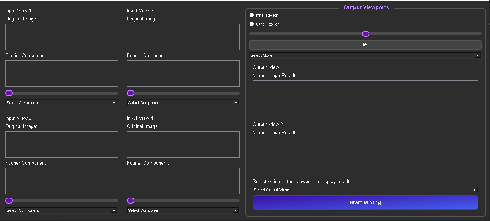

# Image Mixer

**Digital Signal Processing - Task 4**

---

## Overview

Image Mixer is a Python application designed for **Digital Signal Processing (DSP) Task 4**. This tool enables users to seamlessly blend multiple grayscale images using their Fourier Transform components. With an intuitive GUI, users can manipulate Fourier components such as Magnitude, Phase, Real, and Imaginary, to generate unique mixed results and visualize them in real time.


---

## Key Features

- **Load and Manage Multiple Images:**
  - Import up to four grayscale images for simultaneous processing and mixing.

- **Fourier Component Selection:**
  - Choose from Magnitude, Phase, Real, or Imaginary components of each image to create tailored results.

- **Adjustable Weighting:**
  - Assign specific weights to each Fourier component to control their influence on the final output.

- **Frequency Region Masking:**
  - Apply **Inner Region** or **Outer Region** masks to target specific frequency areas within the Fourier domain.

- **Real-time Visualization:**
  - Display the original images, their Fourier components, and the resulting mixed images in real time.

- **Interactive Brightness & Contrast Controls:**
  - Adjust the brightness and contrast of images using intuitive mouse interactions.

- **Dark-Themed Interface:**
  - A visually comfortable dark mode for prolonged usage.

---

## Application Interface

The graphical interface offers a clean and organized layout for streamlined user interaction:

### GUI Overview



**Descriptions:**
1. **Input Viewports:** Display original images and their Fourier components.
2. **Output Viewports:** Show the mixed result based on the selected Fourier components and adjustments.
3. **Interactive Controls:**
   - Weight sliders for each component.
   - Selection dropdowns for Fourier components.
   - Region selection (Inner/Outer masks) and blending modes.
4. **Start Mixing Button:** Initiate the blending process and view results in the output view.

---

## How to Use

1. **Load Images:** Import grayscale images into the four available input slots.
2. **Select Fourier Components:** Use the dropdown menus to choose specific components for processing.
3. **Adjust Weights:** Modify the influence of each selected component using the sliders.
4. **Apply Masks:** Toggle between inner or outer region masking and adjust the region size.
5. **View Results:** Visualize the mixed output in the designated output view.
6. **Save Results:** Export the mixed image if needed.

---

## Installation

### Prerequisites:
- Python 3.8+
- Required Libraries:
  - NumPy
  - OpenCV
  - Matplotlib
  - PyQt or PySide (for GUI)

### Steps:
1. Clone the repository:
   ```bash
   git clone https://github.com/your-username/image-mixer.git
   ```
2. Navigate to the project directory:
   ```bash
   cd image-mixer
   ```
3. Install dependencies:
   ```bash
   pip install -r requirements.txt
   ```
4. Run the application:
   ```bash
   python app.py
   ```

---

## Future Enhancements

- Support for RGB image mixing.
- Integration of advanced Fourier domain filters.
- Expanded output customization options.
- Enhanced performance for large image files.

---

## License

This project is licensed under the [MIT License](LICENSE). Feel free to contribute and adapt the code for your needs.

---

## Acknowledgments

This project is part of the **Digital Signal Processing** course. Special thanks to the course instructors and team members for their guidance and support.

